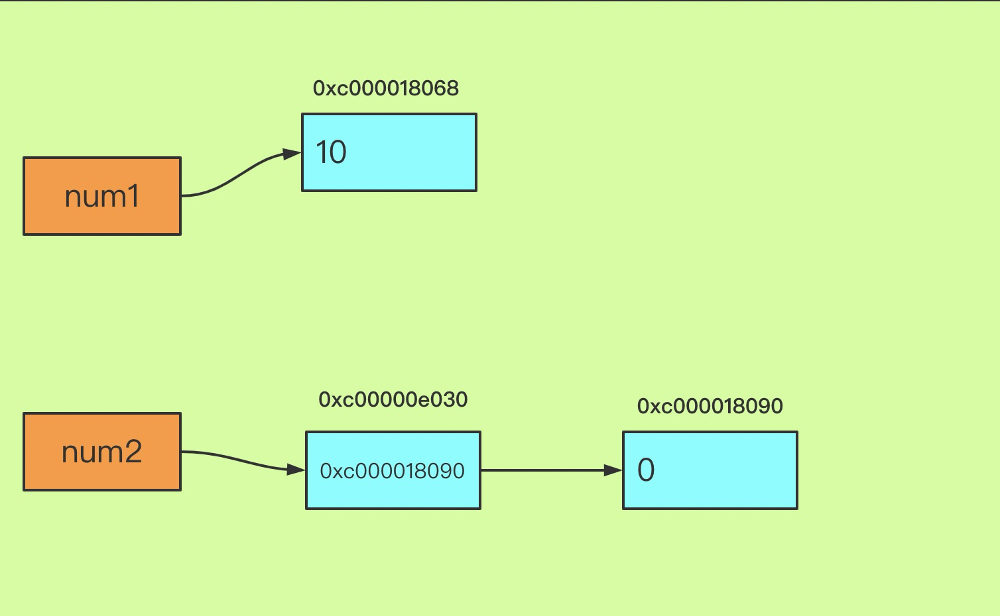

# go语言类型地址与值


## 基本类型

```go
num1 := 10
fmt.Printf("num1 type: %T , num1=%v , &num1=%v\n", num1, num1, &num1)

num2 := new(int)
fmt.Printf("num2 type: %T , num2=%v , &num2=%v\n", num2, num2, &num2)
fmt.Printf("num2 指向的值: %v\n", *num2)
```



