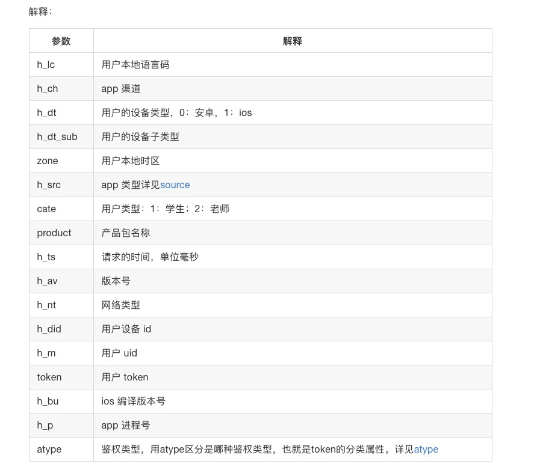

# 接口列表


## 任务


```json
"talentarchive"	: 人才数字档案
"okr"			: okr系统
"qtapi"  		: 对内系统http
"ktapi"  		: 对外系统http
"app" 			: 对外app 
```


```json
"storage" 		: 文件存储服务
"organization"  : 组织架构微服务。查询员工、部门信息等
"uauth"  		: 内部鉴权
```


## 测试

```json
研发部-技术中台

系统平台	部门ID : 1361954
	"zhaojinxin10242"
	"guozhaofan13731"
	"zhenghe3119"
基础平台	部门ID : 1361986
```

## app参数列表



Source 说明：http://confluence.pri.ibanyu.com/pages/viewpage.action?pageId=16614161

